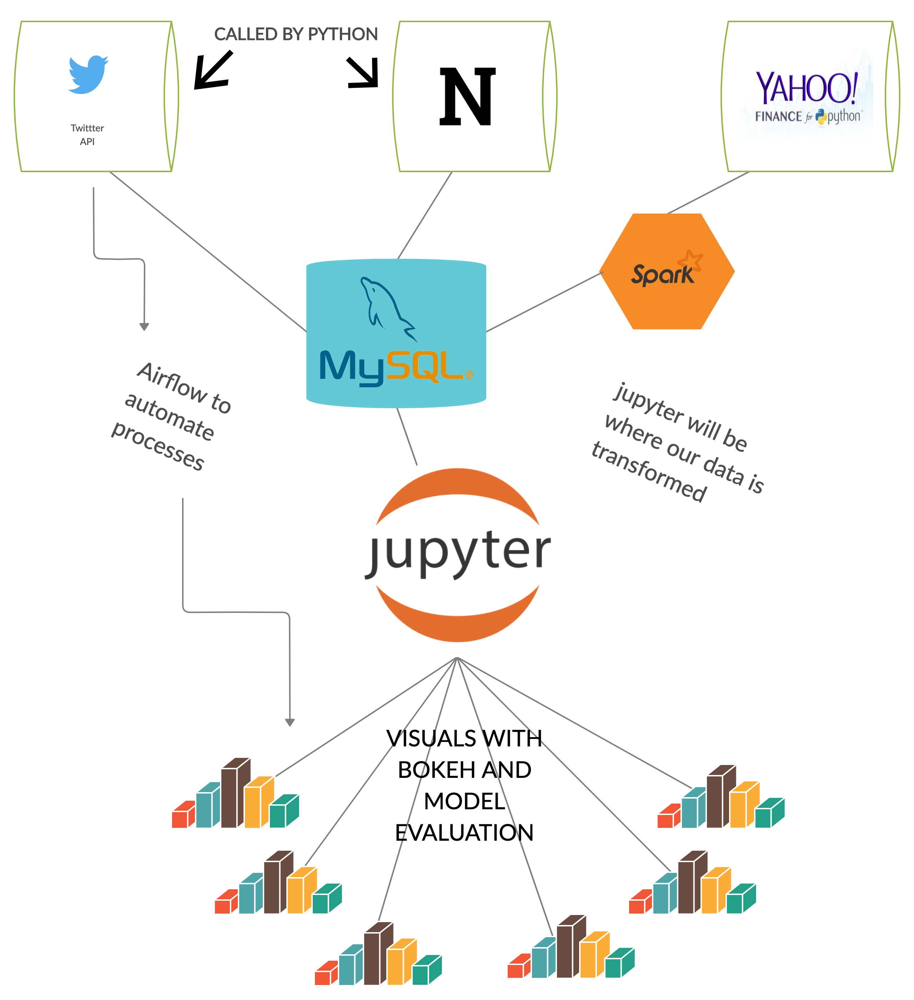

## Sentiment Analysis amd Correlation with Stock Price Changes

This project uses Apache airflow to run a data pipeline that fetches tweet count data from [Twitter API](https://developer.twitter.com/en/docs), and Headline totals from [News API](https://newsapi.org/). It also uses spark to get daily price changes (opening and closing daily) using [Yahoo Finance API](https://pypi.org/project/yfinance/). 

Data obtained from each source is stored into a MYSQL database.

The data is then analysed to find the sentiments and its correlation with price movement of the stock.

Finally, the data pipeline uses Papermill to execute jupyter notebook for preparing the final visualization report using Bokeh to show various visualizations on the collected data.

# APIs Used
* Twitter API
* News API
* Yfinance API

# Frameworks/Platforms Used
* Airflow
* Jupyter Notebook
* Spark
* Pandas
* Papermill
* NLTK
* Bokeh

# How to use the source code
 - Create accounts with twitter and news api to get the required keys for calling the apis.
 - Update the json files with the api keys and other parameters of py file locations to be run through the data pipeline
 - Copy the dags (data pipeline) file sentiment_analysis_data_pipeline_ps.py and save it in your dags folder of your Airflow environment
 - upload the pipeline JSON file in Airflow as a parameter
 - Schedule and trigger the data pipeline form Airflow